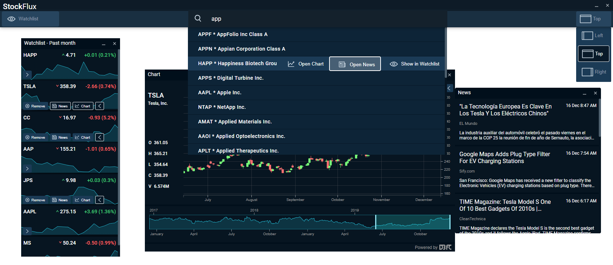

# StockFlux

Stockflux is a suite of applications, components and libraries developed by [Scott Logic](http://www.scottlogic.com) designed to showcase the latest in Openfin and FDC3.



Here are a few things to try:

- Group and dock multiple apps together
- Reposition the launcher with the controls in the right hand side of the launcher
- Quickly launch any one of our Applications from the icons on the left hand side
- Search for a symbol and:
  - Add it to your watchlist
  - View the last 2 years of OHLC data
  - Read the latest news stories

## Installing

In order to install the Launcher application, download the StockFlux installer [here](https://install.openfin.co/download/?os=win&config=https%3A%2F%2Fstockflux.scottlogic.com%2Fapi%2Fapps%2Fv1%2Fstockflux-launcher%2Fapp.json&fileName=stockflux&unzipped=true) and run the executable. If you haven't already installed an OpenFin application, this will install the required runtime. It'll also add the shortcut to StockFlux to your desktop and start menu.

The project is deployed and hosted by AWS, so with each time the application is ran the latest released version will be used. This means no further installations will be needed to keep the installed project up to date.

## Applications

### Core

#### StockFlux Launcher

The launcher is considered the entry point for the applications. It allows the user to search for symbols and the ability to launch the News, Chart and Watchlist applications.

#### StockFlux Watchlist

The watchlist allows the user to save a list of symbols that they may wish to view news stories or chart data about.

#### StockFlux Chart

A chart application to show OHLC(Open, High, Low, Close) symbol data over the last 5 years.

#### StockFlux News

A simple news viewer that shows the user the latest 10 stories about their chosen symbol.

#### StockFlux Container

A headless app that creates and manages child windows of the Chart and News applications.

### Supporting

#### StockFlux Core

A collection of common services and util methods that are shared across the suite of applications.

#### StockFlux Components

A collection of common components shared across the core applications.

#### StockFlux Bitflux

Bitflux is our charting library, this is what powers the Chart application.

### Key Tech used

- [React](https://reactjs.org/)
- [Create React App](https://facebook.github.io/create-react-app/)
- [FDC3](https://fdc3.finos.org/)
- [Openfin](https://developers.openfin.co/docs)
- [Openfin Layouts](https://developers.openfin.co/docs/layouts-api)

### Run Locally

The suite was designed to be a set Openfin applications. To install Openfin for local development run the following command:

```bash
npm install -g openfin-cli
```

More information on Openfin-cli can be found [here.](https://github.com/openfin/openfin-cli)

To start you must first build the some of the supporting applications.

```bash
npm install
npm run bootstrap
npm run build
```

In isolation each app can be ran individually with the following commands:

```bash
npm start
npm run launch
```

The applications run on the following ports:

| Application | Port |
| ----------- | ---- |
| Chart       | 8051 |
| Watchlist   | 8052 |
| Launcher    | 8053 |
| Container   | 8055 |
| News        | 8056 |

If these port selections conflict with another service you may be running they can be changed in the `package.json` file of each application.

### Run FDC3 service locally

To launch our apps together as a full suite that can interact with each other we need to run the [FDC3 service](https://github.com/HadoukenIO/fdc3-service) locally. **Since the FDC3 service is still in development phase we used [the project at this commit](https://github.com/HadoukenIO/fdc3-service/tree/0b0f21f0a7c9ec0cbf67b068bbb20563d2534566) locally and in AWS.** The FDC3 service repo has instructions on how to run it locally but at the time of writing (25/06/2019) there is not a clear way of making it point at our App Directory URL. Currently it defaults to it's own json file. To make it point to either a local or AWS hosted version of our app directory we need to make the following change in the file `AppDirectory.ts`

`const URL = {YOUR_URL}`

If you are running the app directory locally, by default, it will be found at:

`http://localhost:3000/api/apps/v1`

The AWS hosted version is at:

`https://stockflux.scottlogic.com/api/apps/v1`

Once this change has been made you can run the service start launching applications from it.

The FDC3 service will be ran from port `3923`

#### Sample App Directory

To run your own sample app directory please refer to the readme in the [Stockflux-Cloud repository](https://github.com/ScottLogic/StockFlux-Cloud).

#### AWS Hosted Version

The application suite and it's APIs are all hosted on AWS. The standalone Openfin Installer can be found [here](https://install.openfin.co/download/?os=win&config=https%3A%2F%2Fstockflux.scottlogic.com%2Fapi%2Fapps%2Fv1%2Fstockflux-launcher%2Fapp.json&fileName=stockflux&unzipped=true)

The installer requires no dependencies or prior configuration to be ran.

### Project Package Dependency Diagram


### How the apps communicate

The Application make use of the [Intents API](https://fdc3.finos.org/docs/1.0/intents-intro) and the [InterApplicationBus](https://developer.openfin.co/jsdocs/stable/fin.desktop.InterApplicationBus.html) to launch each other and pass messages. The Chart and News applications are not launched via intents as we allow the user to launch multiple of them. The Container application registers their intents and creates child windows when called.


